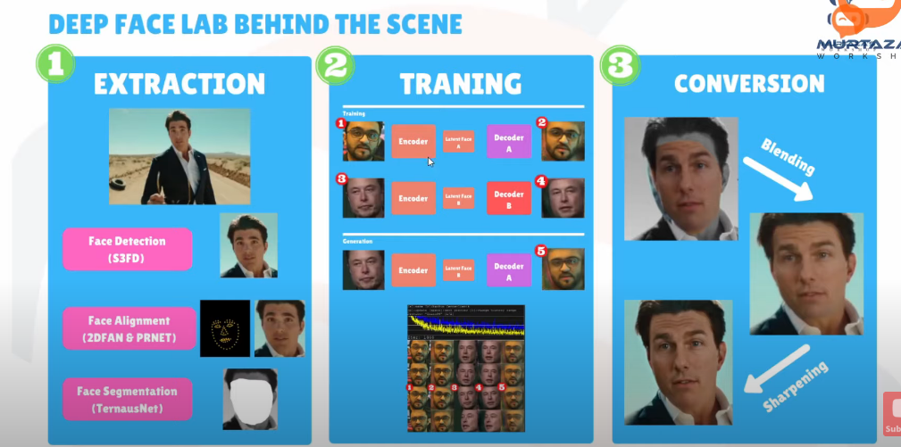
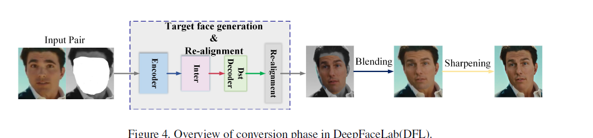
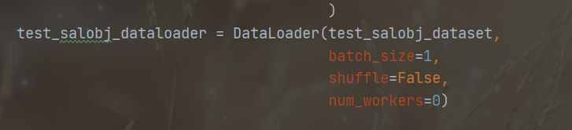
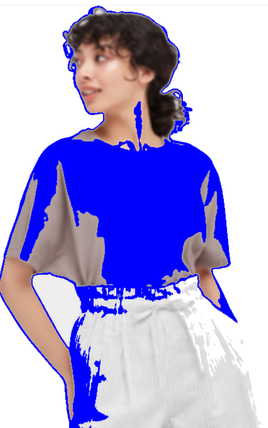
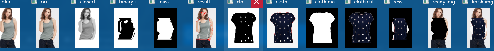
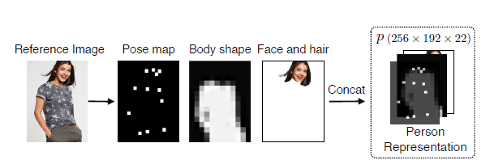

二值图像 灰度图像 彩色图像

IOU交并比 越高难度越大

 基于模板的人脸匹配？

adaboost:

多个弱分类器级联得到强分类器

后来面部识别难度加大，人脸形态，环境不同

非约束条件下的人脸检测

基于深度学习的方法

卷积神经网络，但直接使用滑动窗口加神经网络会导致计算量过大

NMS 非极大值抑制，去重 比如多个框识别同一个人脸

预训练：先初步渐小到结果域的距离

神经网络：层数越多越抽象

人脸检测vs人脸识别

人脸识别：

**基于特征匹配的方法**

数据预处理

协方差矩阵

求特征值，特征向量

依据取大的一部分特征值，基 子空间

原始矩阵投影到子空间，降维矩阵

平均脸 为什么平均脸更好看

**基于深度学习的方法**

CNN

提取特征向量，替代人工设计的特征

DeepFace CVPR 2014

人脸对齐->6个卷积层->2个全连接层

**人脸验证**

人脸关键点检测/定位/人脸对齐

关键点粗定位

关键点微调

## CV_WORK1

dlib的facial_landmarks 检测：

- 0-16 下颚
- 17-21 左眉毛
- 22-26 右眉毛
- 27-30 鼻子
- 31-35 鼻孔
- 36-41 左眼
- 42-47右眼
- 48-60 嘴唇
- 61-67 嘴巴中间

大眼算法

论文：Interactive Image Warping（1993年Andreas Gustafsson）

## deep fake 

大致流程：

1. frames extraction 对数据源data_src和data_dst要求高，最好两个视频中的人都有相似的表情，相似的脸部大小，脸部来源的那个人要有各个角度的脸，推荐data_src中脸的数量在3000-8000。

2. face extraction  

    a) Full Face/FF - for FF models or lower face types (Half Face/Hf and Mid-Half Face/MF, rarely used nowadays).

    b) Whole Face/WF - for WF models or lower, recommended as an universal/futureproof solution for working with both FF and WF models.

    c) Head - for HEAD models, can work with other models like WF or FF but requires very high resolution of extraction for faces to have the same level of detail (sharpness) as lower coverage face types, uses 3D landmarks instead of 2D ones as in the FF and WF but is still compatible with models using those face types.

3. sort faces and cleanup 利用算法根据图片相似度等进行分类，去除不佳的结果。如misaligned,有遮挡的，模糊的，别人的脸，不完整的，受光线影响太大的

4. 可选: 强化数据集。比如对模糊或者低清晰度的脸upscale

5. 可能还要进行重新抽取

6. XSeg masks 

    a pretrained Generic WF XSeg model included with DFL (_internal/model_generic_xseg), if you dont have time to label faces for your own WF XSeg model or just need to quickly apply basic WF masks to your sets you can use the following .bats to do so:

7. **What is XSeg for?** Some face types require an application of different mask than the default one that you get with the dataset after extraction, those default masks are derived from the landmarks and cover area similar to that of full face face type, hence why for full face or lower coverage face type XSeg is not required but for whole face and head it is. XSeg masks are also required to use Face and Background Style Power (FSP, BGSP) during training of SAEHD/AMP models regardless of the face type.

    

    XSeg allows you to define how you want your faces to be masked, which parts of the face will be trained on and which won't.

    对脸部要替换部位的mask，但是能覆盖WF whole face，一边后续可以调整贴合

    XSeg也可以：XSeg can be used to exclude just about every obstruction

    Masks define which area on the face sample is the face itself and what is a background or obstruction, for SRC it means that whatever you include will be trained by the model with higher priority, whereas everything else willl be trained with lower priority (or precision). For DST it is the same but also you need to exclude obstructions so that model doesn't treat them as part of the face and also so that later when merging those obtructions are visible and don't get covered by the final predicted face (not to be mistaken with predicted SRC and predicted DST faces).

    and more

8. training common models: SAEHD 6GB+ AMP 6GB+ Quick96 2-4GB quick96 好多参数都锁定了

9. merging 把学习到的新脸与目标视频每一帧融合 

10. 转化成视频 MP4等

11. final result

## CV_WORK2

最开始想法：先不考虑图案，从颜色考虑，通过提取衣服的颜色识别衣服的轮廓。失败

之后尝试标准流程，细节见图：

可以发现效果还是很不好，主要是对原来模特衣服的截取做的不好

至此，我认为换衣工作的难点在于：

1. 原来模特图像的身体部分需要更加细节的提取工作，包括精确识别肩膀部分，脖子部分，驱赶部分，胳膊部分等

2. 对于给定要换的衣服要能根据目标模特的原来衣服的形态做出正确形变调整。如果仅仅是单色的衣服或者材质单一，可能还相对好处理，但是如果衣服上有logo图案等标签，就很困难了。

    

针对以上情况，我后来又做了一些尝试但是都不太理想，自己的想法很简陋，无法应对模特姿势的改变和衣服图案的复杂性。

在查阅相关研究之后，我找到了一些热门的虚拟穿搭论文以及实现。

以前的虚拟换衣技术基本都是基于3D模型的，其最大的优点就是效果稳定。但基于3D的换衣技术在硬件部署和计算效率上成本很高，而且获取3D数据本身就是一件很困难的事情。为了降低3D计算的成本，人们的注意力开始转移到基于2D图像的虚拟换装技术。

该算法目的很明确，就是给定两张图像，一张是包含穿着任意衣服的人的图像，另一张是一件衣服的图像，算法就会生成一张这个人穿着这件指定衣服的图像，并且保留这个人原始的姿势，头部等信息，仅改变身上的衣服。

- VITON: An Image-based Virtual Try-on Network（CVPR 2018）

    第一篇专注于图像的换衣的 项目使用的数据集是涉及到zalando公司的利益而版权受到限制，无法获得数据集

    

    指标：

    1. 人的身体部位和姿势与原始图像相同。
    2. 最终图像中的服装需要根据人的姿势和体型自然变形。
    3. 视觉图案清晰可见，不仅包括颜色和纹理等低级特征，还需要包括刺绣、徽标等复杂图形。

    

    1. 保留人体信息： posemap，body shape face hair 合成与衣服无关的人体表示

        pose heatmap：

        

    2. 生成一个粗糙的合成图像 `Encoder-Decoder` 框架 通用的 `U-net` 体系结构，可以跳过连接，在层之间直接共享信息

    3. 细化网络，对上一层的图像细节做处理

    4. 扭曲要换的衣服：

        1. 首先提取衣服的前景 `mask`。
        2. 然后计算生成器生成的 `mask` 和衣服的 `mask` 之间的 `TPS` 形变。
        3. 利用计算出来的 `TPS` 参数，进一步将原始的衣服扭曲成人身上穿着的衣服的形状。

    5. 图像合成

        扭曲好的衣服与生成的粗糙的合成图像进行匹配，与其中的衣服区域进行无缝连接，并且在手臂遮挡的情况下依然有效

- Toward Characteristic-Preserving Image-based Virtual Try-On Network ECCV 2018

    这篇文献是对 VITON 的一个改进，相较于 VITON，CP-VTON 在生成试衣图像时并没有采用 shape context matching，而是采用了一种 tailored convolutional neural network。

- Deep Virtual Try-on with Clothes Transform（ICS 2018）

- SwapNet: Image Based Garment Transfer（ECCV 2018）

- Towards Photo-Realistic Virtual Try-On by Adaptively Generating↔Preserving Image Content, CVPR 2020

    找到了目前一个比较新的论文实践，本次实验也是主要基于它的。

实验一的视频做得怎么样了 眼睛颜色特效视频模式

cpviton 还可以试一下效果

